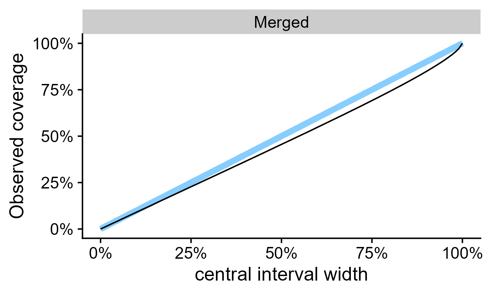

```{r setup, include=FALSE}
options(htmltools.dir.version = FALSE)
library(SBC)
library(ggplot2)
library(dplyr)
library(magrittr)
library(tidyr)
theme_set(cowplot::theme_cowplot())

knitr::opts_chunk$set(echo=FALSE, cache = TRUE, fig.width = 4, fig.height=2.5)
```


class: center, middle, inverse

# Background - Biology

---

background-image: url("img-cc/Pair_of_mandarin_ducks.jpg")
background-position: center
background-size: cover
class: inverse

# Differential expression

.img_credit[
Image by By Francis C. Franklin, Wikimedia Commons CC-BY-SA 3.0
]

---

# Differential expression 

.large_fig[
```{r diffexpexample, dpi = 300, out.width="400px"}
set.seed(445554)
crossing(data.frame(id = 1:5), data.frame(Condition = c("Control", "Treatment"),
                                          mu = c(20,50))) %>%
  mutate(reads = rnbinom(n = n(), mu = mu, size = 3)) %>%
  ggplot(aes(x = Condition, y = reads)) + geom_point(position = position_jitter(width = 0.2, height = 0, seed = 456))
```
]

---

# DESeq2

$$
\begin{align}
y_{g,s} &\sim \mathrm{NegBinomial\_2}(\mu_{g,s} r_s, \frac{1}{\tau_g}) \\
\log(\mu_{g,s}) &= \alpha_g + X_s \beta_g  \\
\log \tau_g &\sim \mathrm{N} \left(\frac{a}{\mu_{g}} + b, \sigma_\tau \right) \\
\end{align}
$$

--

Primary output: p-values for interval hypotheses

???

Bunch of other methods to share dispersion

---

class: center, middle, inverse

# Background - Statistics

---

# Why confidence intervals?

DESeq2 does a good job with interval hypothesis

--

We might want to order genes by LFC

--

.mid_fig[

]

---

# Frequentist calibration of CIs

In x% of repetitions of the exact same experiment, x% confidence interval will contain the true value.

???

Assuming the model is correct. Needs to hold for any parameters! -> Worst case, asymptotic results, bounds

---

# The secret frequentists don't want you to know

1) Define likelihood

2) Maximize likelihood

3) ????

4) Profit! 

---

# The secret frequentists don't want you to know

1) Define likelihood

2) Maximize likelihood

3) ~~????~~ Compute Hessian

4) ~~Profit!~~ Assume normality  

--

5) Publish!

---

# Bayesian calibration

Averaged over the prior, x% credible interval will contain the true value x% of the time.

???

Assuming the model is correct. Can be exact.

---

# Simulation-based calibration

--

1. Simulate data _exactly_ according to the model

--

1. Fit the model to simulated data and draw $M$ samples from the posterior.

--

2. Take the rank of the true value within the samples
  - Rank: no. of samples < true value

--

3. Across many simulations, this rank should be uniformly distributed between $0$ and $M$


---

class: center, middle, inverse

# What I did

---

# Bayesian interpretation of DESeq2

Frequentist models $\simeq$ Bayesian models

--

- Flat priors

- Posterior is normal


???

DESeq2 was intended as Empirical Bayes
Note that this is the same assumption as before!

---

# Priors for the DESeq2 model

$$
\begin{align}
y_{g,s} &\sim \mathrm{NegBinomial\_2}(\mu_{g,s} r_s, \frac{1}{\tau_g}) \\
\log(\mu_{g,s}) &= \alpha_g + X_s \beta_g  \\
\log \tau_g &\sim \mathrm{N} \left(\frac{a}{\mu_{g}} + b, \sigma_\tau \right) \\
\end{align}
$$

--

$$
\alpha \sim N(4,2); 
\beta \sim \mathrm{N}(0,1)
$$

$$
\sigma_\tau \sim \mathrm{HalfN(0, 1)} ; a \sim \Gamma(3, 6) ; b \sim \Gamma(4, 2.3)
$$

???

Note that we are in between estimating dispersion and known dispersion

---

# Sampling from DESeq2

DESeq2 provides standard error (via Hessian)

1. Use normal approximation

2. Use T approximation with


---

class: center, middle, inverse

# Results

???

Only showing some settings, but results broadly consistent

---


# 3 replicates, default settings

- I.e. using the `apeglm` Student's T shrinkage


.large_fig[

]


---

# 3 replicates, default settings

Coverage of 95% CI: 91%

.large_fig[

]


---

# 3 replicates, no shrinkage

Coverage of 95% CI: 94%

.large_fig[

]

???

We are kind to the frequentist, because we are not testing all possible values.

---

# 3 replicates, T

Coverage of 95% CI: 98%

.large_fig[

]

---

# 20 replicates, default settings

Coverage of 95% CI: 93.5%

.large_fig[

]


---

# Multiple comparisons

Correction for multiple comparisons applies also to CIs!

--

E.g., for the 3 replicates without shrinkage:

95% CI coverage:  94%

95% CI coverage when p < 0.1:  67%

---

# DESeq - conclusions

- The CIs of DESeq2 can be slightly miscalibrated

--

  - Especially with few replicates

--

  - p-values still valid

--

- Bayesian interpretation of DESeq2 results is _somewhat_ possible
  
--

- Correct CIs for multiple comparisons

---

# Thank you - Questions?

https://github.com/cas-bioinf/SBCDESeq2

Talts et al. 2020 (http://www.stat.columbia.edu/~gelman/research/unpublished/sbc.pdf)

`SBC` R package

https://github.com/hyunjimoon/SBC/

This work was supported by ELIXIR CZ research infrastructure project (MEYS Grant No: LM2018131) including access to computing and storage facilities.
